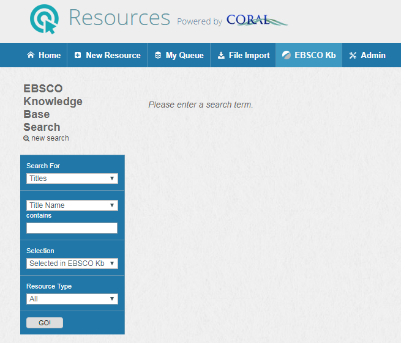
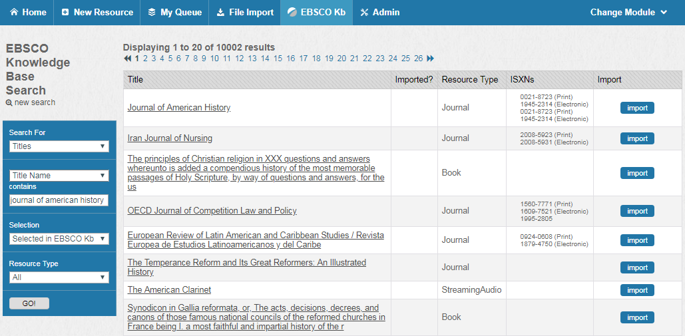
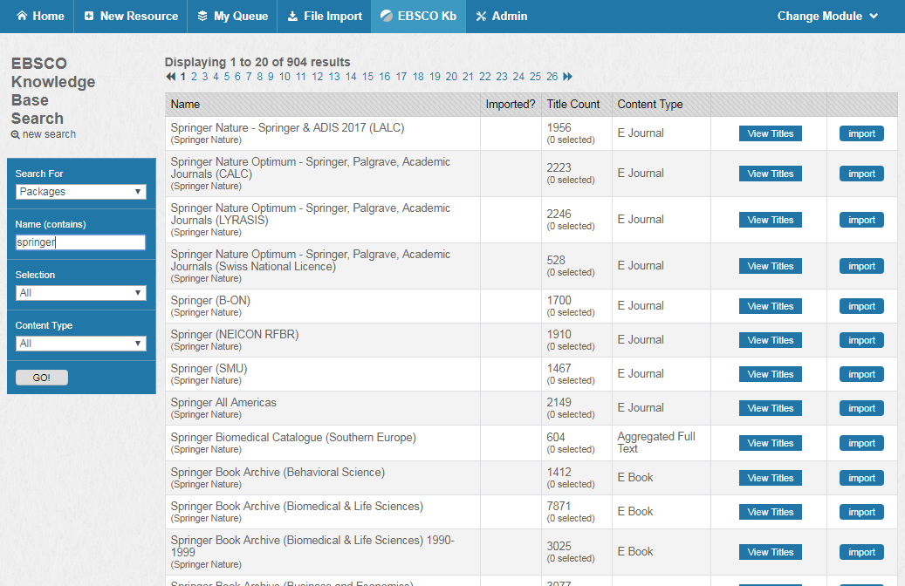
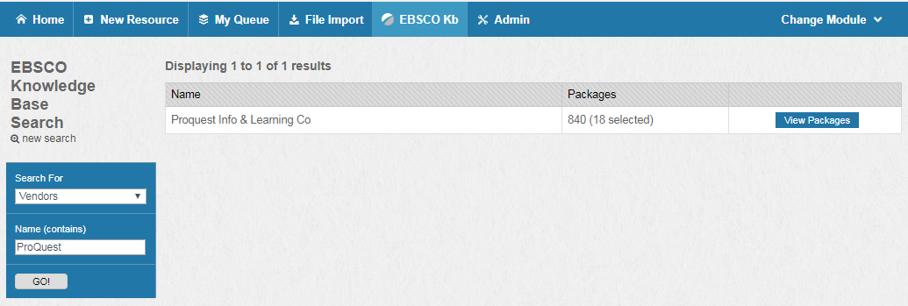
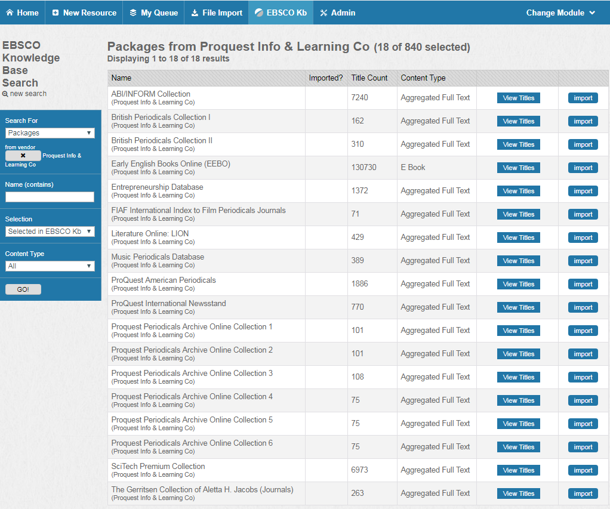
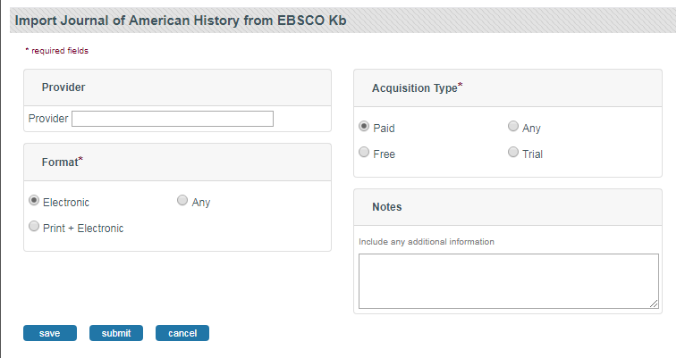
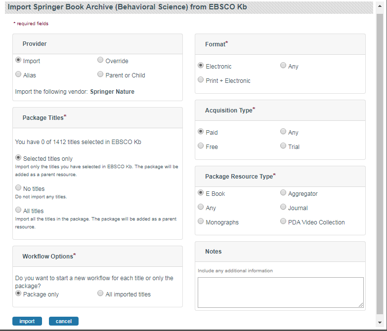

Using EBSCO's Knowledgebase with CORAL
---------------------------------

### About CORAL and EBSCO's Knowledgebase Integration

If your library has an EBSCO account, you can integrate the EBSCO Knowledge Base (EBSCO KB) with CORAL. Integrating the EBSCO KB enables your library to search for EBSCO titles, packages, and vendors from CORAL as well as import titles and packages directly into CORAL. When you import titles or packages from EBSCO, CORAL automatically creates resources along with their titles, descriptions, access URLs, resource identifiers, subjects, and coverage dates. After you set up your EBSCO Kb integration, you can access this page using the EBSCO KB option.

Before you set up your integration and start importing information from the EBSCO KB, you should familiarize yourself with the terminology that EBSCO KB uses. The EBSCO KB uses the following three data types:

Note: Please note that EBSCO KB integration does not permit the importing of over 10,000 records.  Attempting to import 10,000 or more records may cause a time-out or other EBSCO API error.

- **Titles**—Titles are synonymous with CORAL Resources. When you import a title from the EBSCO KB, the title is stored in CORAL as a resource. A title might be a journal, book, or even a service such as the EBSCO Discovery Service.

- **Packages**—Packages are collections of titles in the EBSCO KB. When you import a package from the EBSCO KB, the package is stored in CORAL as a parent resource for all of the titles it contains. An example package is JSTOR Arts and Sciences I Archive Collection.

- **Vendors**—Vendors are synonymous with CORAL organizations. When you import a title or package, the associated vendor is assigned to the resources that CORAL creates as an organization with the provider relationship.

### Setting up the EBSCO KB

Before you can integrate the EBSCO KB, your library must have an EBSCO Customer ID and a valid RM API key. If you have an EBSCO account and Customer ID but you do not have an RM API key, you should [request an RM API key](https://developer.ebsco.com/signup) from EBSCO. Once you’ve received your API key, continue with the following steps to set up your THE EBSCO KB integration with CORAL:

1. From any page in the Resources module, click Admin from the top menu.
2. From Admin page, select the EBSCO KB Config tab.
3. Select the Enable EBSCO Knowledge Base checkbox.
4. Type your Customer ID and API Key.
5. Click Save.

After you have finished setting up your EBSCO KB integration, an EBSCO KB option displays in the primary navigation menu of each page in the Resources module. You can click the option to search the EBSCO KB. 

### Searching the EBSCO KB

Once you’ve integrated the EBSCO KB, you can search the EBSCO Kb for titles, packages, and vendors. 

#### To search for titles in the EBSCO KB

1. From any page in the Resources module, click EBSCO Kb from the top menu, then click New Search.
2. Select Titles from the Search For drop-down list.
3. Select either Title Name, Publisher, ISXN (ISBN or ISSN), or Subject, depending on the search field that you want to search by.
4. Type your search terms in the contains field.
5. Select which titles from the EBSCO Kb you want to search from the Selection drop-down list. You can choose one of the following options:

	**All**—Searches all titles from the EBSCO KB.

	**Selected in EBSCO Kb**—Searches only the titles that are selected in your EBSCO account.

	**Not Selected**—Searches only the titles that are not selected in your EBSCO account.

	**Ordered through EBSCO**—Searches only the titles that are selected in your EBSCO account and were purchased through EBSCO.

6. Select the types of titles you want to limit your search to from the Resource Type drop-down list.
7. Click Go!.

After your search results are displayed, you can view the details for titles and import them into CORAL. 

#### To search for packages in the EBSCO KB

1. From any page in the Resources module, click EBSCO KB from the top menu, then click New Search.
2. Select Packages from the Search For drop-down list.
3. Type your search terms in the Name field.
4. Select which packages from the EBSCO KB you want to search from the Selection drop-down list. You can choose one of the following options:

	**All**—Searches all packages from the EBSCO KB.

	**Selected in EBSCO Kb**—Searches only the packages that are selected in your EBSCO account.

	**Not Selected**—Searches only the packages that are not selected in your EBSCO account.

	**Ordered through EBSCO**—Searches only the packages that are selected in your EBSCO account and were purchased through EBSCO.

5. Select the types of packages you want to limit your search to from the Content Type drop-down list.
6. Click Go!.

 
After your search results are displayed, you can view the details for packages and import them into CORAL. 

#### To search for vendors in the EBSCO KB

1. From any page in the Resources module, click EBSCO KB from the top menu, then click New Search.
2. Select Vendors from the Search For drop-down list.
3. Type your search terms in the Name field.
4. Click Go!.

After your search results are displayed, you can view the packages associated with a vendor and then import an entire package or individual titles from a package.

### Importing titles from the EBSCO KB

You can import titles that you have found using the EBSCO KB search. When you import titles from EBSCO, CORAL automatically creates resources with all of their relevant metadata, including the following fields:

- Title

- Description

- ISSNs or ISBNs

- Subjects

- Resource Type

- URLs

Note: If a title has more than two URLs, any additional URLs will be added to an access note for the resource. Additionally, the primary and alternate URL will be programmatically selected based on the URL's recency (newer URLs are preferred), length of embargo period (shorter periods are preferred), and coverage (longer coverage periods are preferred).

Coverage dates and embargo periods
EBSCO KB ID (allows subsequent imports to update the resource information rather than creating a new resource)

#### To import titles from the EBSCO KB

1. Do one of the following:

	a. From the list of EBSCO KB search results, find the title you want to import and click Import.

	b.  From an EBSCO title's details, click Import.

2. Type the name of the organization that will be the Provider for the resource that CORAL creates.

3. Select a **Format** and **Acquisition Type**.
4. Add any notes, as necessary.
5. Click Submit.

Note: Once you have submitted a resource, you can track its progress in the Submitted Requests tab on the My Queue page. Submitted resources also display in the resources list on the Home page with a status of In Progress.

### Importing packages from the EBSCO KB

You can import packages that you have found using the EBSCO KB search. When you import packages from EBSCO, you decide what information is imported into CORAL. By default, when you import a package, CORAL creates the following:

- A new resource containing the package's information.

- A new resource for each selected title within the package. Each new resource is associated as a child resource of the package.

Note: CORAL also imports each title's relevant metadata when it creates these resources. 

- A new organization that is associated with each resource. By default, this organization is based on the EBSCO vendor.

- The EBSCO KB ID (allows subsequent imports to update the resource information rather than creating a new resource).

#### Overview of Fields: Importing packages from the EBSCO KB

Overview of metadata available for package imports.

**Provider**

Specifies the organization that CORAL should associate with the resource that is created for this package. If an organization already exists in CORAL with the same name as the EBSCO vendor associated with the package, CORAL displays the name of the matching organization. If CORAL did not find any matching organization, then you can select one of the following options to specify a Provider instead:

- Import—Creates a new organization in CORAL using the name of the EBSCO vendor associated with the package.

- Alias—Creates an alias for an existing organization using the name of the EBSCO vendor associated with the package.

- Override—Lets you specify an existing organization to use and ignores any of the vendor information from EBSCO Kb.

Parent or Child—Creates a new organization in CORAL and associates the new organization with an existing organization as a parent or child relationship (depending on your selection).

**Package Titles**

Specifies which title information should be imported. A note displays how many titles within the package your library has associated with its EBSCO account. You can select the following options:

- Selected titles only—Creates a new resource for each title within the package that is associated with your library’s EBSCO account.

- No titles—Creates a new resource for the package, but does not import any title information.

- All titles—Creates a new resource for each title within the package, including any titles that are not selected.

**Workflow Options**

Specifies whether a new workflow should be made for only the package, or for the package and each title the package contains. 

**Format**

Specifies the Format that should be associated with the resources that CORAL creates while importing this package and its titles. You can configure the Resource Formats that are available in your system on the Resources module Admin page.

**Acquisition Type**

Specifies the Acquisition Type that should be associated with the resources that CORAL creates while importing this package and its titles. You can configure the Acquisition Types that are available in your system on the Resources module Admin page.

**Package Resource Type**

Specifies the Resource Type that should be associated with the resource that CORAL creates for this package. This setting does not affect the Resource Type associated with the package's titles because CORAL automatically imports the Resource Type for any resource that it creates from a package's titles. You can configure the Resource Types that are available in your system on the Resources module Admin page.

#### To import packages from the EBSCO KB

1. From the list of EBSCO Kb search results, find the package you want to import and click Import.
2.  Select the import options that you want, then click Import.

After you start an import, a progress tracker displays. For large imports (greater than 1000 records) this process can take several minutes. If CORAL encounters any errors during the import, the title name and EBSCO Kb ID are displayed for each title that had an error. You can use this information to import those titles individually, or you can re-import the package and its titles again.