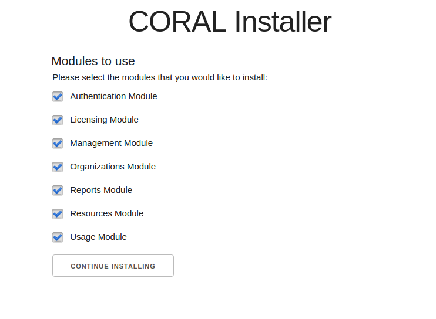
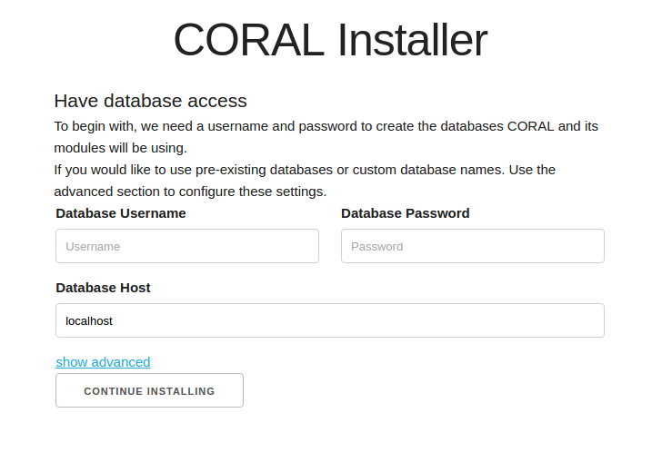
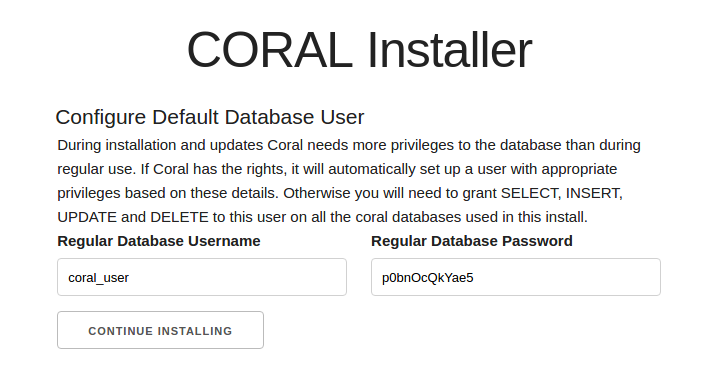
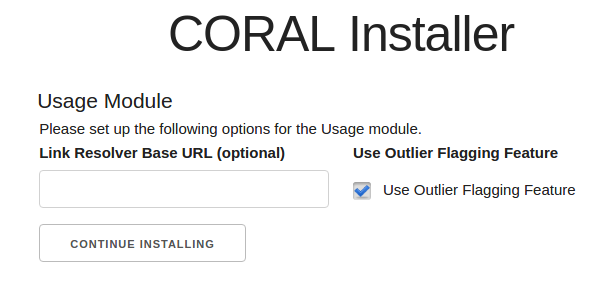
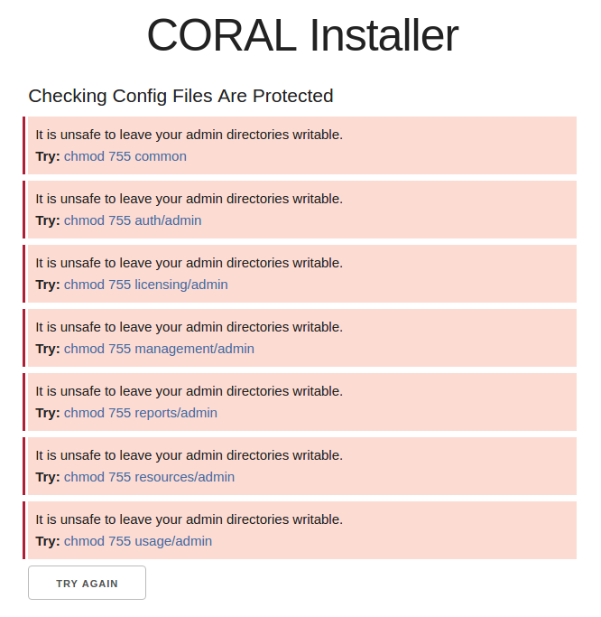
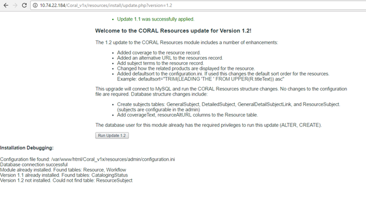
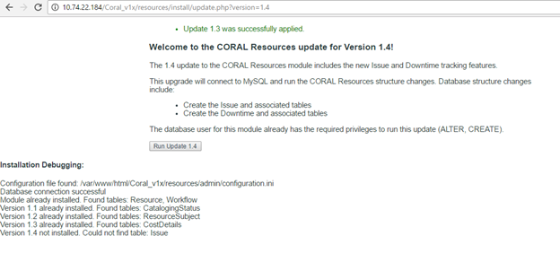
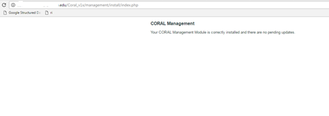
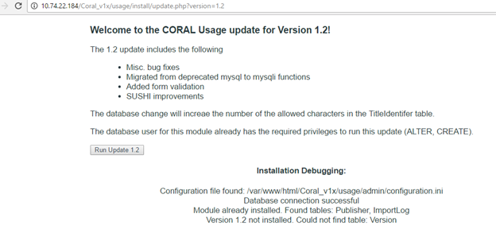

Installing CORAL
----------------

### Supported Browsers 
* Current and recent Firefox, Microsoft Internet Explorer, Microsoft Edge, Safari, Seamonkey, Opera, and Chrome versions are all supported 
* Requires Browser to have Javascript enabled – the CORAL interface relies heavily on AJAX, JQuery and JQuery plugins 

### Server-Side Requirements and Setup 

#### Database
 
CORAL runs with a MySQL 5 backend.  Each CORAL module uses its own MySQL schema.  The recommended format for schema name is `coral_MODULENAME_prod`, e.g. `coral_resources_prod`.  Since the database name is set in the `configuration.ini` file this name can be easily changed. For security purposes it is recommended to have a “coral” user which has select, insert, update and 
delete privileges only (no create table privileges).  This “coral” user should have access to all CORAL databases for interoperability. 

The CORAL modules are heavily data-driven.  As a result we have provided an initial “snapshot” of our 
data which will be inserted when the MySQL tables are created.  Most of this data may be edited 
through the front-end if desired – refer to the user guide for more information. 
For data models and the MySQL Workbench file, refer to [http://docs.coral-erm.org/](http://docs.coral-erm.org/)  

#### Server-side scripting 

A [supported version of PHP 5](http://php.net/supported-versions.php) is a requirement for CORAL since it uses Object Oriented code.  If you are unsure whether you’re
running PHP 5, be sure to install using the web installation script since it will validate your version.  See 
Installation section, below. Please note, a minimum version of PHP 5.5 is supported.

#### Authentication 
Authentication is required for CORAL since all users are given specific privilege levels (for more on
privilege levels refer to the user guide). CORAL has two choices for authentication – either to tie in to
your university/library’s authentication system or to install the CORAL Authentication Module. The Authentication Module also has built in LDAP functionality. For more
information on the CORAL Authentication module, please refer to the [Authentication Documentation](http://docs.coral-erm.org/en/latest/authentication.html).

To utilize your library’s existing authentication system, you will need to know the Server Variable name
to use within PHP. This is a setting within configuration.ini called “remoteAuthVariableName” which will
be set in the installation process (see Installation, below). The remoteAuthVariableName indicates the
PHP server variable name that is set in Apache upon authentication and so CORAL will recognize the
user's login. Different server setups may have different variable names. Assuming you're using an
authentication system already, you can do a phpinfo script to see if this variable is being set and what it is. (just make a .php file and put `<?php phpinfo(); ?>` in it ) Probably the easiest way to find the variable
name would be to search for your user ID.

If you still have problems using your existing authentication system, we would recommend subscribing
to the listserv and looking at the archives to see how other institutions have made it work, or searching the forum.
As a last resort, each module has ‘user.php’ in the root directory which can be modified to retrieve your
users’ login ID.

Also, the `.htaccess` file should require your authentication system, or you should have another way to
require authentication. If you have questions about this, contact your system administrator.

CORAL has limited LDAP username lookup available in most modules. This is different than the more complete LDAP integration present in the Auth module. Within each of the modules (except for Licensing) any user
allowed by the `.htaccess` may visit the site; if LDAP has been set up in the `configuration.ini` it will display
their name in the upper right hand corner. This connection is optional.

### Application Architecture 
CORAL is written using object oriented code.  All classes and configuration are defined under the 
`/admin/` directory.  The admin directory has an `.htaccess` file in order to prevent web users from 
accessing config data. 

`/directory.php` is used to load all of the classes.  This is called from every page and for the ajax functions 
and also contains some globally used functions. 

`/admin/configuration.ini` defines config settings (module settings, database and ldap) 

Common classes are in `/admin/classes/common/` - includes configuration, database connection, LDAP, 
Utility, Email 

#### Database 
All database tables have matching classes and all database SQL code is done within methods of these 
classes. 

Every class extends the DatabaseObject for generic  SQL handling (retrieving all values, inserts, updates, 
deletes).  DatabaseObject is in `/admin/classes/common/` and the database classes are located in 
`/admin/classes/domain/` 

#### Web side 
Pages - `admin.php`, `index.php`, detail view scripts and reports are all shells for positioning divs.  Within 
each div data is updated via ajax calling `ajax_htmldata.php`.  This way when changes are made to the 
data the display can be immediately updated without needing to refresh the entire page. 

A jquery plugin called thickbox is used to display the “popup” forms with the grayed out background. 

`ajax_forms.php` contains all of the html for forms that are being used by thickbox. 

`ajax_processing.php` contains all of the processing (eventually sql insert/updates, etc) that utilize the 
database classes - this is where data is sent after being entered in the forms 

`header.php` and `footer.php` are defined within /templates/ directory. 

`user.php` and `setuser.php` are used for authentication. 

`/css/styles.css` is the general css file used by all pages in coral. 

#### Javascript 
All javascript code is stored under `/js/` directory.  This directory contains javascript for base pages
(`index.php`, `admin.php`) where the names of files correspond with the javascript file name. (e.g. 
`admin.php` uses `admin.js`) 

The directory `/js/plugins/` directory contains third party javascript (jquery library, autocomplete, 
thickbox and other plugins) . 

The `/js/forms/` directory contains all javascript files corresponding to the thickbox forms that are 
generated from `ajax_forms.php` 

#### Naming standards 
If you would like to contribute code / database changes to the project it is recommended that you stay
within the following naming conventions. 

##### Database Naming:
 
* Attribute and entity names in singular form and using present tense 
* Entity names are uppercased with no spaces or underscores between words (camel case) 
* Attribute names have first word lower cased, subsequent words have first letter upper case 
    * e.g. documentID, sentDate, documentText 
* Primary keys are always Auto Incrementing Integers beginning with the table name and ‘ID’ 
suffix 
    * e.g. for the “Document” table, “documentID” is the name of the primary key 
    * (note that the generic database object expects this naming convention – if you do not use this name, you must override the primary key name in the class) 
* When possible, attribute names are suffixed with class words 
    * Code - Has a list of possible values e.g. INV, ENC 
    * ShortName - Name 
    * Identifier (ID)  - Unique Identifier, generally surrogate key 
    * Number - Numeric value 
    * Indicator (Ind) - A Boolean value (0/1)
    * Date - Date 
    * DateTime - Date and time stamp 

##### Code: 
* Refer to previous sections for directory structure, script locations and script naming. 
* Variable, class and attribute names mimic the database standards with camel case. 
* Method names are prefixed with:  
    * Is – Answers a question, returns true/false, e.g. for User class `isAdmin()` method 
    * Get – retrieves a value 
    * Set – sets a value

### Installation 
Installation can occur in one of two ways – either through the web installation script or manually.  Web 
installation will provide advantages over manual installation because it will check MySQL privileges and PHP version and directory permissions.

#### Installing CORAL 2.0

Note: For upgrading to CORAL 2.0 see the following section Upgrading to CORAL

New to CORAL 2.0 is the Unified Installer which simplifies the web installation.

Step 1: Download a copy of the [latest version at Github](https://github.com/Coral-erm/Coral).

Step 2: If you use the option to download the compressed zipped file, expand this file in a working folder.

Step 3: Copy the expanded folder to your webserver.  If using Apache, this would be something like /var/www/html/ folder.  If CORAL will be in a sub folder on your webserver, change the folder name from "Coral-master" to, for example, "coral" or what name you choose.

The web installation depends upon the index.php file found in the coral folder.  Your Apache settings should be set to include loading the index.php file.  

Step 4: Go to the home directory via a web browser to initiate the United Installer script.  

You should see the following.

Step 5: All the modules are selected by default.  De-select any modules not required for your installation and then click the "Continue Installing" button.

Step 6: Follow the instructions for any messages received.

For example, you may receive a message asking to change the folder and file permissions similar to the following.

For example, to correct the file and folder permissions in Linux you would do something similar to the this via your terminal.  Be sure to to run these commands in your Coral folder on the web server.

For example, for Ubuntu Linux you would have something similar to the following.  

    sudo chmod 777 common

    sudo chmod 777 auth/admin 

... and so on.

When finished changing the permissions, click on "Try Again" button to continue the installation.

Step 7: Following this you should see the following, setup CORAL with your MySQL.  Generally, this will be user root or an user that has the necessary privileges (i.e., select, insert, update, 
delete, and create table privileges). This user will not be remembered after the installation since part of the process is to create a new user for CORAL to use in day to day operation. 
However, if you don't want to give the installer user credentials with create database permissions, you can provide one with permission only for specific databases, but you will need to manually create a database for each module and use the Advance MySQL Database Setup form to provide the database names to the installer. After providing the necessary information click the "Continue Installing" button. 

Optional - Advance MySQL Database Setup form as seen below will allow you to customize your database names.

Step 8: Setup a regular database user.  As noted this user will need SELECT, INSERT, UPDATE and DELETE privileges. If the MySQL username you already gave CORAL has permission to create a new user it will create the name and password you provide here. Otherwise you will need to provide a username and password that you have manually configured in the database already. When finished adding the username and password click the "Continue Installing" button. 

Step 9: Setup default user.  This account will be used to administer other users and features in CORAL.

Step 10: Setup for Auth Module.  This includes setting up the session timeout and the whether or not to use [LDAP](https://en.wikipedia.org/wiki/Lightweight_Directory_Access_Protocol) for authentication.  The session timeout represents seconds.  When finished click the "Continue Installing" button.

Step 11: If not using LDAP, setup an admin password for the Auth Module.  Passwords must be at least 8 characters long.

Step 12: Choose whether or not to use the [Terms Tool](http://docs.coral-erm.org/en/latest/terms.html) functionality.

Step 13: Setup Link Resolver Base URL and Outlier Flagging Feature

The Link Resolver Base URL provides a quick way to view complete holdings from within the Usage Module.  Likewise, the Outlier Flagging is used in the Usage Module to help flag imported usage data that appears incorrect.  See the [Usage Statistics Guide](http://docs.coral-erm.org/en/latest/usagestats.html) for more information.

Again, click the "Continue Installing" button when finished. 

Step 14: Setup Resources Module

Step 15: As instructed update your file permissions for better security.

When finished updating click on the "Try Again" button.

When finished you should briefly see a message indicating what modules have been successfully installed.  The message will redirect to the CORAL home page in 10 seconds.

#### Upgrading to CORAL

Note: To upgrade to CORAL 2.0 and following you need to be sure all your modules are updated to the latest 1.x versions.  Before starting any upgrade process make a backup of your previous CORAL installation and data.

**Installation Notes:**
* There is a separate install for each module
* The CORAL-Main module does not have an installation script. You simply need to copy the module files into the parent `/coral/` folder.
* If you need to re-run installation for any reason you can do so **but it will remove any data in the 
database and reset to original data load!** 
* Be sure to remove the `/install/` directory once installation is complete

##### Steps for Upgrading to the latest 1.x versions

**Auth Module**

Step 1: [Download the latest 1.x Auth Module (v.1.1.1)](https://github.com/ndlibersa/auth/archive/v1.1.1.zip) and unzip the file into a webserver folder.

Step 2: Copy the `configuration.ini` file from the `admin` folder of your current Auth module into the `admin` folder of the latest Auth module.  

PLEASE NOTE: For all the following steps "latest ... module" refers to your expanded download of the latest version of CORAL that you are upgrading to.

Your Auth module should now be upgraded to the latest version of CORAL 1.x

**Resources Module**

Step 1: [Download the latest 1.x Resources Module (v1.4.1)](https://github.com/ndlibersa/resources/archive/v1.4.1.zip) and unzip the file into a webserver folder.

Step 2: Copy the `configuration.ini` file from the `admin` folder of your current Resources module into the `admin` folder of the latest Resources module.

Step 3: Copy the content of the `attachments` folder of your current Resources module into the `attachments` folder of the latest Resources module.

----------
Note:

If you require Unicode support, be sure to check the following settings and update as needed.  Older versions of CORAL/MySQL implementations may not have been setup for Unicode support.  

In the `install/protected` folder of the latest Resources module, go to the `update_1.4.sql` file found under the latest Resources module.  Remove the comment from the following line and replace the placeholder `_DATABASE_NAME_` with your current Resources module database name.  Be sure to save your changes when finished.

Here is the line you are changing.

--ALTER DATABASE '_DATABASE_NAME_' CHARACTER SET utf8 COLLATE utf8_general_ci;

----------

Step 4: Open up a browser and type the URL pointing to your latest Resource module followed by `/install/update.php` and hit enter.  The v1.4.1 Resource update script can detect your current Resource module version.  Let's assume your current Resource version is v1.0.0.  If so, you should see the first screen below.

Step 5: Click the "Run Update 1.1" button.

 
Step 6: Click the "Run Update 1.2" button.

Step 7: Click the "Run Update 1.3" button.

Step 8: Click the "Run Update 1.4" button.

You should now see the following 

Step 9: Secure or move the install folder under the latest Resources module to a safer location.

**Organizations Module**

Step 1: [Download the latest 1.x Organizations Module (v1.3.1)](https://github.com/ndlibersa/organizations/archive/v1.3.1.zip) and unzip the file into a webserver folder.

Step 2: Copy the `configuration.ini` file from the `admin` folder of your current Organizations module into the `admin` folder of the latest Organizations module.

----------
Note:

If you require Unicode support, be sure to check the following settings and update as needed.  Older versions of CORAL/MySQL implementations may not have been setup for Unicode support.  

In the `install/protected` folder of the latest Organizations module, go to the `update_1.4.sql` file found under the latest Organizations module.  Remove the comment for the following line and replace the placeholder `_DATABASE_NAME_` with your current Resources module database name.  Be sure to save your changes when finished.

Here is the line you are changing.

--ALTER DATABASE '_DATABASE_NAME_' CHARACTER SET utf8 COLLATE utf8_general_ci;

----------

Step 3: Open up a browser and enter the URL pointing to your latest Organizations module followed by `/install/upgrade.php` and hit enter to see the screen below.

Step 4: Click on the "Continue" button.  The next screen should look like the following.

Step 5: Fill in the fields for hostname or IP address of the host where your CORAL database is running, the current Organizations database name, and the database username and password granted permissions to the Organizations database.  Click on the "Continue" button when finished.

 

Step 6: Secure or move the `install` folder under the latest Organizations module to a safer location.

**Licensing Module**

Step 1: [Download the latest 1.x Licensing Module (v1.4.2)](https://github.com/ndlibersa/licensing/archive/v1.4.2.zip) and unzip the file into a webserver folder.

Step 2: Copy the `configuration.ini` file from the `admin` folder of your current Licensing module into the `admin` folder of the latest Licensing module.

Step 3: Copy the content of the `attachments` folder from your current Licensing module into the `attachments` folder of the latest Licensing module.

Step 4: Copy the content of the `documents` folder from your Licensing module into the `documents` folder of the latest Licensing module.

Step 5: Open up a browser and enter the URL pointing to your v.1.4.2 Licensing module followed by `/install/update.php` and hit enter.  You should see the following.

Step 6: Click the "Run Update 1.2" button.

Step 7: Click the "Run Update 1.3" button.

Step 8: Since there are no database changes since v.1.3.0, your installation is updated to v.1.4.2.  Secure your CORAL installation by moving the latest 1.x `install` folder for your Licensing module to another location.

**Management Module**

Step 1: [Download the latest 1.x Management Module (v1.2.0)](https://github.com/ndlibersa/management/archive/v1.2.0.zip) and unzip the file into a webserver folder.

Step 2: Copy the `configuration.ini` file from the `admin` folder of your current Management module into the `admin` folder of the latest Management module.

Step 3: Copy the content from the `attachments` folder of your current Management module into the `attachments` folder of the latest Management module.

Step 4: Copy the content of the `documents` folder of your current Management module into the `documents` folder of the latest Management module.

Step 5: Open up a browser and enter the URL pointing to your latest Management module followed by `/install/update.php` and hit enter.  You should see the following and have Management module v1.2.0 installed.

 

Step 6: Secure or move the `install` folder for the latest 1.x Management module to a safer location.

**Usage Module**

Step 1: [Download the latest 1.x Usage Module (v1.2.1)](https://github.com/ndlibersa/usage/archive/v1.2.1.zip) and unzip the file into a webserver folder.  Alternatively, for those comfortable with git may prefer to check out v.1.2.1 rather than download.

Step 2: Copy the `configuration.ini` file from the `admin` folder of your current Usage module into the `admin` folder of the latest Usage module.

Step 3: Open up a browser and enter the URL pointing to your latest Usage module followed by `/install/update.php` and then hit enter.  You are on v.1.0.0 and should see the following.

Step 4: Next we need to upgrade from v. 1.0.0 to v1.1.  [Download Usage Module v.1.1](https://github.com/ndlibersa/usage/archive/v1.1.zip) and unzip the file into a webserver folder.  Or, if you use git, switch to v.1.1.  Enter the URL pointing to the v1.1 Usage module followed by `/install/update.php` and hit enter to see the following.

Step 5: Click the "Run Update 1.1"

Step 6: Now switch back to the v1.2.1 `update.php` file.  Enter the URL pointing to your latest Usage module followed by `/install/update.php` and hit enter.

Step 7: Click the "Run Update 1.2" button.  You should see the following and have v.1.2.1 installed.

Step 8: Secure or move the install folder for the latest 1.x Usage module to a safer location.

**Reports Module**

Presently, v.1.0.0 is the only version of the Reports module, so there is no need to upgrade this module.

#### Notes for Installing CORAL 2.0 Manually

When you first [download the code](http://coral-erm.org/download), you will want to place the unzipped 2.0 code in your web server directory. 

You will need to configure each module individually. 

Depending on whether the module allows you to upload attachments or documents you may also need 
to `chmod 777` some directories:  
For Licensing – both `/licensing/attachments/` and `/licensing/documents/` directories  
For Usage Statistics – both `/usage/archive/` and `/usage/log/` directories  
For Resources – `/resources/attachments/`  

#### Getting Started
 
**Install database tables**

Step 1: Create new database schema (recommended name is `coral_modulename_prod`)

Step 2: Apply the SQL file to your new database. These can typically be found in the /module/install/ directory.

Step 3: Manually add an admin user into User table – this is required for the first person to administer users. If you are going to use the auth module you will need to add the admin user there as well as each other module's User table. 

- Open your MySQL client
- Navigate to your database (`coral_modulename_prod`) and to the User table
- Insert  your LoginID (either the one you've already added to the Authentication Module, or your externally authenticated login ID) with a  Privilege ID of 1 (equates to admin) and your first and last name, if desired.
- This is the user who will have access to the Admin page to first administer other users.  From the Admin Page, you can designate another user with the admin privilege for that person to also administer users.

**Update Configuration.ini files**
For each module follow these steps.
Step 1: Rename `/admin/configuration_sample.ini` to `/admin/configuration.ini`

Step 2: Edit the `/admin/configuration.ini` file under `[settings]`

**Interoperability Flags**
- `organizationsModule=`
- `authModule=`
- `licensingModule=`
- `resourcesModule=`
- `usageModule=`
  
These switches define whether you have the other CORAL modules installed and would like the interoperability turned on.  The switch will also turn on/off the link to other modules (the Change Module drop down menu in the upper right-hand corner).  Valid values are Y or N.  Interoperability currently occurs between:
 

- Resources to Licensing and Organizations 
- Organizations and Licensing (both directions) 
- Usage Statistics to Organizations

**Interoperability Database Names**
- `organizationsDatabaseName=`
- `licensingDatabaseName=`
- etc.

When you have interoperability turned on between Organizations and Licensing database or Organizations 
and Usage Statistics you must supply the database name (e.g. `coral_organizations_prod`) for the connection.  Also note that the user you connect with must have select, insert, 
update and delete privileges to this database. 
  
- [resources only] `defaultCurrency=`

This will set the currency that is selected by default in the Resource Payment section.  Default currency needs to be a valid Code in the Currency tab on the Admin page.
  
- [resources only] `enableAlerts=`

This will turn on the alerting checkbox on the Acquisitions tab on the Resource page for subscription end dates.  The days in advance 
and email addresses can be set in the Alert Settings on the Admin page.  Also note this requires a scheduled job, see below on Resources Alerts Scheduling.
 
- [resources only] `catalogURL=`

If you would like to include a link directly into your catalog 
from the Resource page you can place your URL with the parameter for the System Number at the very end.  For example, ours is: 
"http://alephprod.library.nd.edu/F/?func=direct&doc_number="
 
-[resources only] `feedbackEmailAddress=`

This is the global email address for all 
workflow notifications - starting, queue entries and completion.  Emails for specific steps can be set in the User Group section on Workflow/User Group tab of the Admin page.  The feedback email address also shows on the Resource Right Panel.  It is optional.
 
- [licensing only] `useSFXTermsToolFunctionality=`

This will turn on/off the SFX tab and 
Terms Tool Report in the licensing module.  Valid values are Y/N.
  
- [usage only] `reportingModule=`

This will turn on/off the reporting link in the usage 
statistics module.  Set to Y if you are using the reporting module add-on (this is a separate install).  Valid values are Y/N.

- [usage only] `useOutliers=`  

This will turn on/off the outlier flagging feature.  This feature 
will calculate abnormal spikes in usage and color code them red, orange or yellow based on the formula defined in the admin tab.  Valid values are Y/N.
  
-[usage only] `baseURL=`

This will turn on or off a created link within the module to your open URL.
 
- `remoteAuthVariableName=`

This is the server variable used by php to determine the 
user authorized to log in.  For example, we use `$HTTP_SERVER_VARS['REMOTE_USER']`, `$_SERVER['PHP_AUTH_USER']`, or `$_SERVER['WEBAUTH_USER']` may be other names.

- [resources only] `defaultsort=  `

Changes the default sort order for the resources.  Example: defaultsort=\"TRIM(LEADING 'THE ' FROM UPPER(R.titleText)) asc\"  It is optional.

Step 3: Under `[database] `

- `type=mysql  `
currently only MySQL is supported but other database types could be supported if modifications to the generic database classes are made
 
- `host=  `
MySQL server could be localhost as well
 
- `name=  `
Database name (e.g. coral_resources_prod)
 
- `username=  `
recommended to have a single user with select, update, insert, delete 
access to all CORAL modules 

- `password=  `
password for above mentioned user
 
Step 4:  Under \[ldap] (optional – not for Licensing Module or Usage Statistics Module) 
    1. Host=  
server name 
    1. Search key =  
filter parameter used in `ldap_search` call – for more info refer to 
http://php.net/manual/en/function.ldap-search.php 
    1. Base DN=  
The Base DN for the directory(`base_dn` parameter used in `ldap_search` call) 
    1. First Name Field=  
Name of the field that LDAP uses for first name – for us it’s 
“givenname” 
    1. Last Name Field=  
Name of the field that LDAP uses for last name – for us it’s “sn” 
1. For security reasons, remove the `/install/` directory once the installation is complete
1. If you are using an external authentication system, you will need to require it in the `/coral/[module_name]/.htaccess` file
1. If you are installing more than one module for interoperability you may see errors from either 
side until both modules are installed.
1. Join the listserv used for product updates, support, and general discussion by sending an email to listserv@listserv.nd.edu. Leave the subject line blank and include 'SUBSCRIBE CORAL-ERM Your Name' in the body; ex. SUBSCRIBE CORAL-ERM John Smith.

**CORAL 2.0 Configuration.ini**
There is one last configuration.ini file that you'll need to edit. In the root coral directory you will see a /common/ directory. Inside is a `configuration_sample.ini` file which you will want to copy or rename to `configuration.ini`

- `[installation_details]` has a `version = ` which should be set to `"2.0.0"`
- `[database]` has the same values that you entered for that section in the specific modules
- each module has it's own entry like `[licensing]` with `enabled=` and `installed=` flags which can be set to `"Y"` or `"N"` 

## Additional Server Configuration
### Resources Alerts Scheduling 
The Resources module includes a script called `sendAlerts.php` that can be run nightly to send out 
subscription alerts. To set it up via cron job, you will need to invoke php. You need to access the alerts page via curl or wget in order to generate emails with functional links:

`0 0 * * * /usr/bin/wget http://YOUR_PATH…/coral/resources/sendAlerts.php`

You will also need to verify that enableAlerts is set to Y in `/resources/admin/configuration.ini`

Note that this will send an email to the feedbackEmailAddress also set in `configuration.ini`.  For 
temporary testing purposes you may wish to change or remove this email address.  The number of days 
in advance and other email addresses can be modified in the Alert Settings tab of the Admin page. 

### Additional CORAL Resources customization options 

#### Payment formatting 
To change the format of the display of amounts (e.g. use a comma in the place of a period), you can 
modify the `/resources/directory.php` file, `integer_to_cost()` function.  The `number_format` function is a
php function – refer to PHP documentation for more information: 

http://php.net/manual/en/function.number-format.php

#### Date formatting 
To change the format of the date from the US standard MM/DD/YYYY you can modify the 
`/resources/directory.php` file, `format_date()` function.  The `date()` function is a php function – refer to 
PHP documentation for more information: 

http://php.net/manual/en/function.date.php

The date will need to be convertible by the php `strtotime` function.  For European dates the `strtotime` 
function requires dashes be used instead of slashes.  Also for the year, be sure to use Y (uppercase) for 4 
digit year and y (lowercase) for 2 digit year. 

Additionally for date formatting you will need to update a javascript file for the date picker calendar 
functionality.  Be sure this format matches the format you set in `directory.php`! 
`/resources/js/common.js`, line 35: 

`Date.format = 'mm/dd/yyyy';`

or 

`Date.format = 'dd-mm-yyyy';`

#### Email customization 
The templates for the workflow notification and alert emails are located in `/admin/emails/`

You can modify the text in these as needed, leaving the words inside brackets `< >` as is – you can change
where they appear but leave the format alone. 

### Upgrades 
Upgrades to CORAL will be announced through the CORAL ERM Listserv.  If you wish to be added, please 
consult http://coral-erm.org or email coral-admin@listserv.nd.edu directly. 

In general, small upgrades with simple coding changes will not be given their own version numbers.  If
an institution notifies us about a bug we will let them know directly when the bug fix is available.  
Versioning will happen when there is a database structure change or configuration file change. 

When performing upgrades your configuration file (`/admin/configuration.ini`) should always be backed 
up first so that when you check out the new code you are sure to not overwrite it. 

After you have checked out the new code through GitHub, there will be a file called `UPGRADE_README` in 
the install directory which will detail the database changes and configuration changes incorporated in
that version change. 

As with the Installation, you have two choices for how to upgrade – either manually or web install.   

For the web install, go to `/install/update.php` and follow the instructions on the screen.  

For the manual install, refer to the `UPGRADE_README` file in the install directory for instructions on 
how to upgrade – instructions may be different depending on what types of changes are included with 
the upgrade. 

**After performing upgrade, be sure to remove your `/install/` directory.**

### New to PHP? 
If your institution is new to the PHP/MySQL setup, installation may be a bit more tricky. 

First off, make sure that you’re both installing php with the `-with-mysql` option and installing the phpmysql package.  To verify that php and mysql are installed and working correctly, you can make a test 
php script with only the following: 

`test.php` contents:  

`<?php phpinfo(); ?>`

To debug issues with authentication you can override authentication in the 
`/coral/modulename/user.php` script. 

You may also wish to change the error reporting level in `php.ini` if you are getting blank pages in the
install or with the CORAL pages themselves. 

### Possible issues during installation (or - things to verify if CORAL is not working at this point) 
Verify you’re running PHP 5 

Verify your database user can connect to the MySQL database and that all tables were created properly 

If your login isn’t working, verify that you have required your authentication service in the `.htaccess` file.  
You should be prompted with your institutions default login screen before getting to the CORAL screens. 

If you’re not sure what your remoteAuthVariableName, you can try the following: 
Create a file called test.php on your web server with the following line:  
`<?php phpinfo(); ?>`  
Then, bring this up in your web browser.  Search for your login ID and it should display the server 
variable in the lefthand column.

If interoperability isn’t working (you’ll know it’s not working when you get red errors), verify that you 
have the database setting and that your database user can connect to that database.  Also, be sure to complete installation of both modules involved.

If your remote user auth variable isn’t working, verify that you have `register_globals = On`