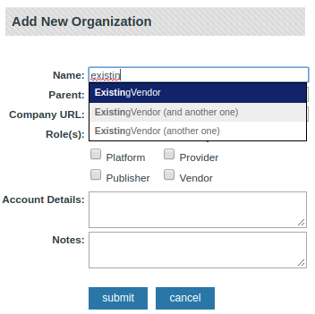
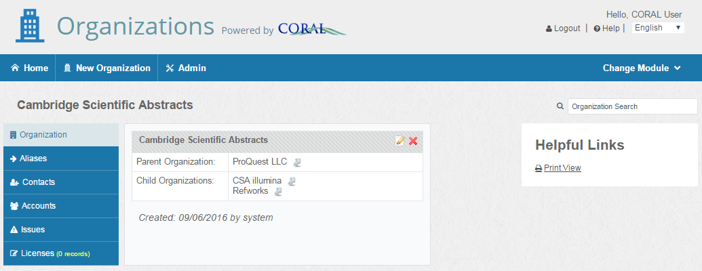
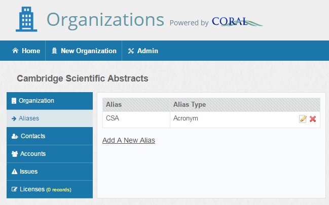
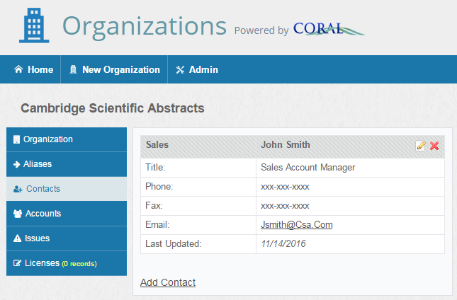
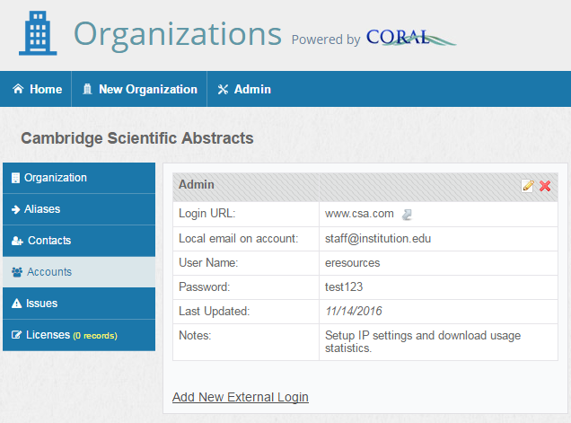
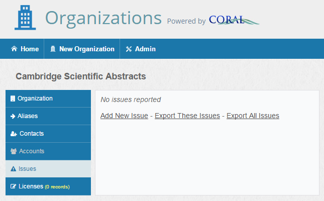
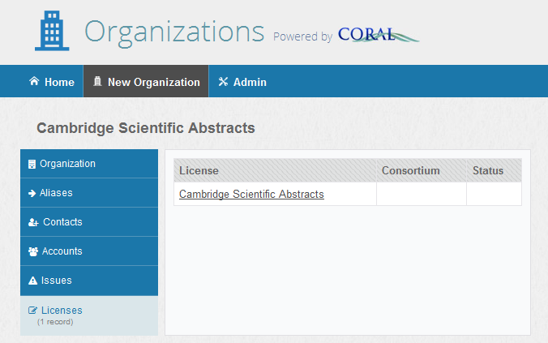
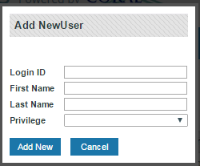

CORAL Organizations User Guide
------------------------------

### About CORAL Organizations

CORAL Organizations provides a way to manage contact and account information for variety of organizations customized by the user.  Some out-of-the-box organizations include publishers, providers, vendors and consortia.

CORAL TIP: New installations pre-populate the Organizations module with numerous organization names.    

### Component Overview

CORAL Organizations has three major components in the main navigation at the top of each page.

- Home
- New Organization
- Admin

#### Home

The home screen contains a search on the left and a list of organizations on the right.  The up and down arrows in the table header can be used to sort the organizations by name, alias, parent, or role.

 

There are four facets for search.  These facets can be used in conjunction.

**Name (contains):** Searches against organization name and alias. For example, searching with AIP will retrieve the American Institute of Physics when AIP has been designated as an alias for this publisher.  

**Role:** Provides the option to limit a search by an organization’s role (ex. publisher, provider, library, consortium, etc)

**Contact Name (contains):** Search for the name of a known contact (ex. Jane Smith) instead of searching for the name of the organization.   

**Starts with:** Browse all the entries alphabetically by the first letter.  

#### New Organization

Select *New Organization* from the main navigation to begin adding new organization records.

* **Name**:  Name of the organization (i.e. MetaPress, Sage Publications, etc). This is the only required field.

* **Parent:** Name of the parent organization (i.e. Proquest as parent of Chadwyck-Healey). The purpose of the *Parent* field is to relate multiple organizations together and to create an organization hierarchy. The field includes an auto-fill populated by existing organization records. The parent organization must already have an existing organization record in order for it to be assigned. Each organization may have only one parent assigned but multiple organizations may have the same parent thereby creating a useful parent-child hierarchy.

* **Company URL:**  The URL of the organization’s homepage.

* **Role(s):** The organization’s role. The values for this field can be customized through the [Admin](#bookmark=id.26in1rg)page.

* **Account Details:** Account numbers or general descriptive info about a library’s account with the organization.

* **Notes:** General notes.

#### The Organization Record

Here is an organization record for 'Cambridge Scientific Abstracts'. The information on the record is split among six tabs.

* **Organization:** Displays the information found on the New Organizations screen explained on the previous page.

* **Aliases:** Alternate names and acronyms so that the record can be retrieved using various names.

* **Contacts:** Includes contact information for the organization (ex. Email, phone numbers for sales reps).

* **Accounts:** Logins for managing administrator accounts (ex. Username/password logins for usage statistics collection).

* **Issues:** Information about an organization that may be valuable over time such as notes about frequent breaks in access or an oddity in an organization's invoicing process. 

* **Licenses:** Links to the records in [CORAL Resources](http://coral-documentation.readthedocs.io/en/latest/licensing.html) for all licenses from the organization. 

##### Organization

The figure above shows the organization tab for 'Cambridge Scientific Abstracts'. Notice that this screenshot does not display the *Account Details*, *Notes* or *Company URL* fields that were found on the New Organization window on the previous page. These three fields are not displayed because no data was entered into those fields when the record was added.

The *edit organization details* link , will open up a window that allows you to edit the information originally entered in the New Organization’s window.

In this example 'Cambridge Scientific Abstracts' has been assigned ProQuest as the parent organization. The *view* link
 next to ProQuest LLC will open the ProQuest organization record.

##### Aliases

The Aliases tab allows the user to add multiple aliases for the organization.  The default alias types are Alternative Name, Name Change, and Acronym.  These fields can be customized using the [Admin](#bookmark=id.26in1rg)page

##### Contacts

The Contacts tab allows the user to add contact information for both specific personnel and general support.  None of the fields are required except for Role(s).

The values for the *Role(s)* field can be customized through the [Admin](#bookmark=id.26in1rg)page. When the contact is no longer accurate, it can either be deleted (deletion is restricted to users with admin privileges) or archived for historical tracking purposes. Contacts that have the *Archived* box checked are kept in the system but are collapsed beneath a *Show Archived Contacts* link so that all users know that the contact information is out of date.

Contact information can be entered in either CORAL Organizations or CORAL Resources. Contact information which is resource specific may be entered in [CORAL Resources](http://coral-documentation.readthedocs.io/en/latest/resources.html#contacts). Information stored at the organization level will be inherited by individual resources within CORAL Resources.

##### Accounts

The Accounts tab is used for storing login information that library personnel use for site administration, gathering usage statistics, etc.

Account login information can be entered in either CORAL Organizations or CORAL Resources. Account login information which is resource specific may be entered in [CORAL Resources](http://coral-documentation.readthedocs.io/en/latest/resources.html#account). Account login information that is not resource specific (ex. A single administrator login for all Gale databases) should be entered here in CORAL Organizations. Information stored at the organization level will be inherited by individual resources within CORAL Resources.

Add new login information by selecting the *Add New External Login* link.

Most of the fields are self-explanatory, with the exception of

* **Login Type:** Category of login.  Default values are Admin, FTP, Marc, Statistics, Support, Other. You create additional login types using through the [Admin](#bookmark=id.26in1rg)page

* **Local Account Email:** The address of the library personnel registered on the account.

##### Issues

The Issues tab is meant for recording general information about an organization that may be valuable over time. One example would be recording when an organization has frequent breaks in access or significant server downtimes. Another example would be having an organization that is often slow when it comes to sending out renewal invoices. The *add new issue* link opens a new window which includes a date and notes field. This field can be handy for recording the institutional knowledge that exists among various personnel.

##### Licenses

The Licenses tab provides links to the license records entered into [CORAL Licensing](http://coral-documentation.readthedocs.io/en/latest/licensing.html) for all licenses where the organization has been identified as the Publisher/Provider. The hyperlinked license name will open the license record in a new window.

##### Admin

The Admin page is where you can manage the module's user privileges as well as edit the values for organization role, contact role, alias type, external login type, and issue type.
  
#### Adding New Users
The *add new user* link on the Admin page opens the following window.  

If you utilize your institution's existing authentication system, the *Login ID* would be the user’s campus ID.

All valid users are given view only access when logged into CORAL Organizations unless they have specifically been granted additional privileges. You only need to add specific user accounts for personnel that need more than view only privileges. The available privileges are:

* **Admin:** provides full add/edit rights including access to the Admin page and the ability to delete contacts.

* **Add/edit:** provides ability to add/edit organization records and all available fields but does not grant access to Admin page and does not give permission to delete contacts.

* **View only:** provides only the ability to view existing organization records.

* **View only:** provides only the ability to view existing organization records.

