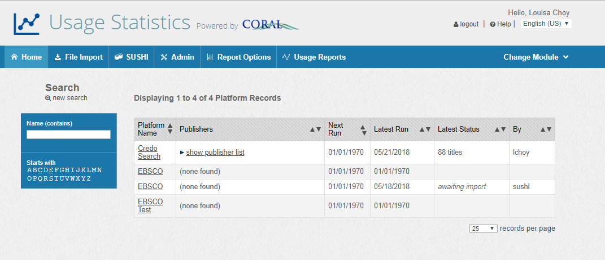
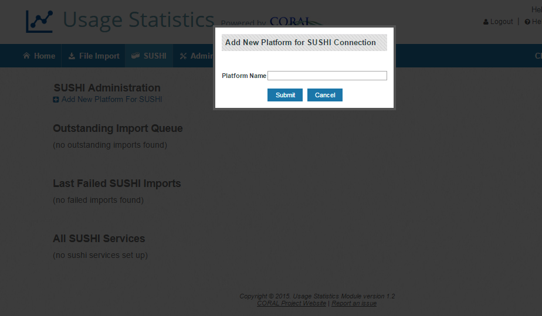
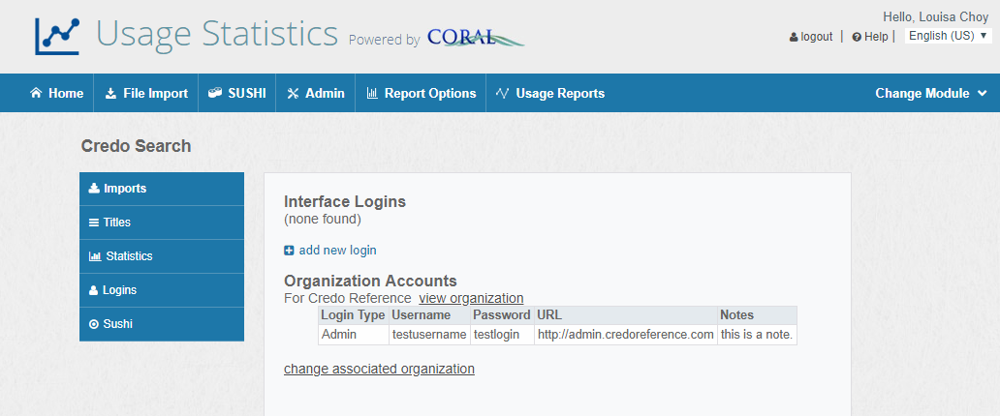
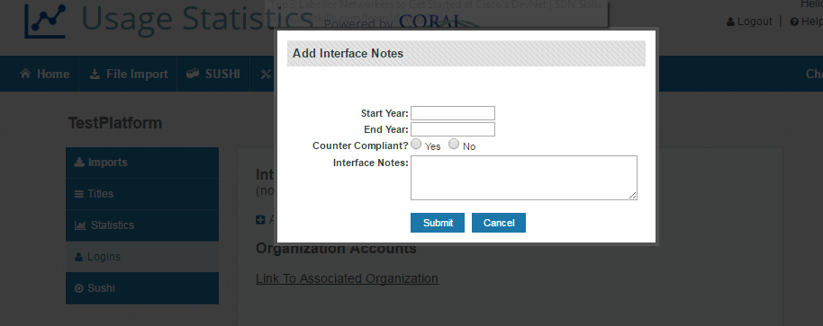
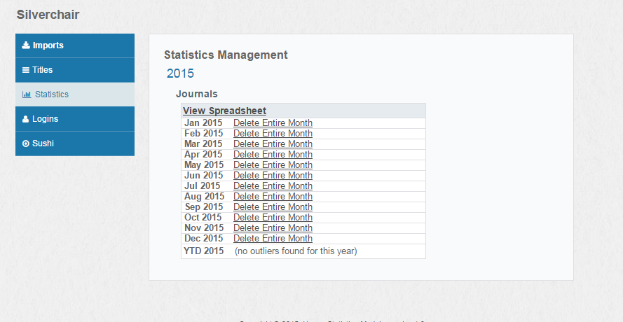
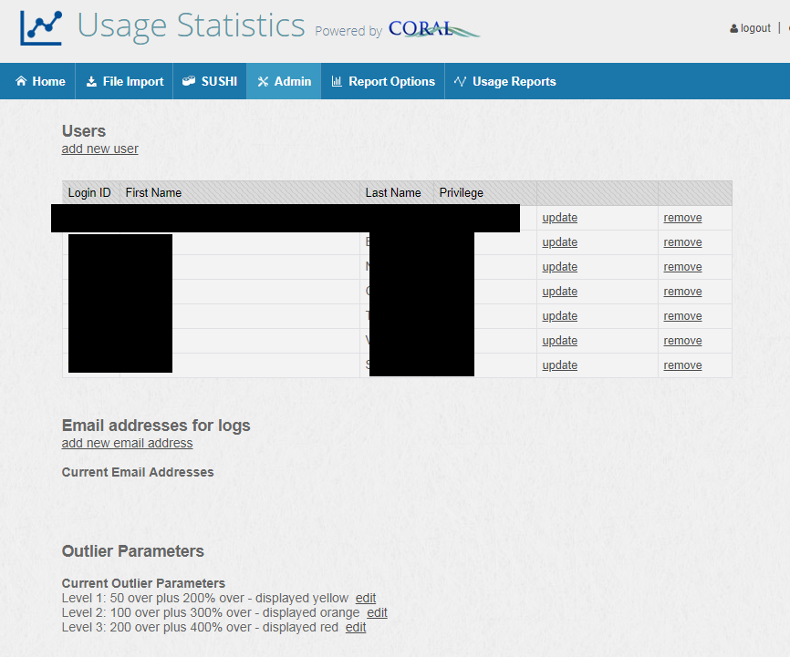
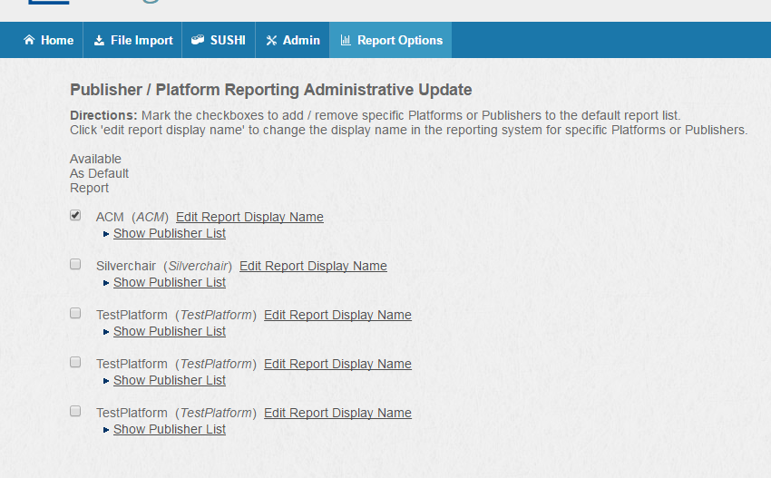

CORAL Usage Statistics User Guide
---------------------------------

### About CORAL Usage Statistics

A component of Hesburgh Libraries locally developed ERM, CORAL Usage
Statistics provides a solution for storing and managing electronic
journal full text download statistic reports. CORAL Usage Statistics
currently supports JR1 and JR1A reports (or any report in a JR1 or JR1A
format). CORAL Usage Statistics also includes a reporting solution
allowing library personnel to retrieve statistics reports. This
reporting solution is available as an add-on and must be installed
separately. Please see the Usage Reporting Add-On Technical
Documentation for more information

.

### Component Overview

CORAL Usage Statistics has four major components in the primary
navigation at the top of each page.

-   Home

-   File Import

-   SUSHI

-   Admin

-   Report Options

#### Home

New statistics reports are uploaded through the Home page. CORAL Usage
Statistics currently supports JR1 and JR1a reports or any report that
has been formatted according to JR1 standards. All reports must first be
saved as tab delimited text files before being loaded into CORAL. The
heading for the month columns should be formatted as MMM-YY.

On the left column of the page are the options for loading the
statistics reports. Notice that there are two checkboxes which accompany
the Upload feature. Be sure to check the box next to ‘This is an Archive
Report (JR1a)’ for all JR1a archive reports. Failure to check this box
will result in CORAL assuming the report is a typical JR1 file.

When processing a new file, CORAL will try and determine whether the
statistics being loaded already exist in the system. For example, if
January and February 2009 statistics for a specific publisher already
exist in the system CORAL will not import those months again on
subsequent loads. The ‘Override previous month verification’ checkbox is
available if the user wishes to bypass this check and to re-import all
of the data.

One the right column of Home is a list of all imported files sorted by
most recent. The list includes a time and date stamp for the upload, the
file name, the user who uploaded the file and detail showing the number
of titles processed. All uploaded files are saved in their original
format on the server and made available in case they are needed in the
future. CORAL produces a detailed log file of the upload which includes
any errors that may occur. This log file is also made available through
the Home page.

When a new file is loaded the data is first displayed on screen before
it is committed to the database. This allows the user a chance to scan
the data for errors before deciding to either confirm the upload or to
cancel.

#### File Import / SUSHI

When a new file is loaded an entry for each Platform and Publisher
combination listed in the file is created. It is through the Publisher /
Platform page that the information about each Platform and Publisher is
accessed. This includes the statistics data as well as the administrator
login required to download new reports from the publishers’ website. As
shown in the picture above, this information can be accessed at both the
Publisher and Platform level. Platforms are listed first and the
corresponding publishers are collapsed. The MetaPress example above has
been expanded to show the corresponding publishers. The ‘view/edit’ link
brings the user to the following detailed information page for the
publisher or platform selected.

Seen here is the platform record for MetaPress. The information is
separated among four tabs; Logins, Notes, Statistics and Titles. The
Logins tab contains the administrator username/password login required
to download new statistics reports. This information can be added in two
ways. First, the login can be added to the record using the ‘add new
login’ link. This opens a new pop-up edit window where the login type,
username, password, url and any pertinent notes are entered.
Alternatively, if the login already exists in the Organizations module a
link to the Organization record can be added. This will then display any
matching logins from the Organizations module here in CORAL Usage.

In the above picture, a link to the MetaPress record in CORAL
Organizations has been entered. The ‘view organization’ link will bring
the user directly to the MetaPress record within CORAL Organizations.
Any account logins that exist on the organization record will be
displayed here within CORAL Usage Statistics. This allows for a single
point of entry for all account logins within CORAL Organizations. Logins
can however still be entered directly within CORAL Usage Statistics if
preferred.

The Notes tab allows the user to identify the years for which statistics
are available as well as identifying which years are COUNTER compliant
reports and which years are not. Also available is the Interface Notes
field. This field is displayed to library personnel within the Usage
Reporting Add-On page explained later in this document. It is meant for
public notes that give added context to the statistics.

The Titles tab displays all of the titles that were included in the
uploaded reports for each Platform and Publisher. A quick scan of this
page after loading a new report will allow the user to check for any
data problems such as duplicate titles or missing ISSN information. The
Titles tab offers two links for each title entry. ‘View related titles’
will open a window showing related titles with the same ISSN. Currently
this is primarily for identifying when an online ISSN from one title
matches the print ISSN from another. The ‘vew related titles’ link
functionality will be changed in a later version of CORAL Usage so it is
perhaps best to ignore the link at this time. ‘View in link resolver’
offers a way to quickly open the link resolver menu for each title in
order to see the full list of holdings. The link resolver base url is
set in a configuration file. See the Usage Reporting Add-On Technical
Documentation for instructions.

The Statistics tab shows all the statistics which have been loaded for
the specific Platform or Publisher sorted with most recent year first.
The data for each year can quickly be opened for viewing in Excel using
the ‘view spreadsheet’ link. It is also possible to delete the data for
individual months.

CORAL Usage Statistics also offers the ability to view and edit outlier
use. When new statistics are loaded into the system, CORAL processes the
data title by title and month by month. For each title, the system
compares each new month’s data against the previous twelve months’
average. The system will tag the month as an ‘outlier’ if the new
month’s data is significantly higher than the expected range of use.
Consider for example a journal which averages ten downloads per month
but then in a new report one of the months shows two thousand downloads.
Two thousand is significantly higher than expected and CORAL will flag
this month as an outlier. This is an extreme example but in the case of
individuals creating personal article archives is not entirely uncommon.

Through the ‘view outliers for this month’ link the user has the ability
to either ignore the outlier, marking it as acceptable, or to override
the outlier with a number that makes more sense and excludes the
problematic use spike. CORAL Usage Statistics allows for three levels of
outliers. The three levels or formulas for the outlier check are edited
on the Admin page discussed next and are also color coded yellow, orange
and red with red being the worst and most extreme outliers.

#### Admin

There are three sections on the CORAL Usage Statistics Admin page;
Users, Email Addresses and Outlier Parameters. When adding new users to
the system there are only two privilege levels available; admin and
add/edit. There is no view only option available. The Usage Reporting
Add-On offers a reporting page which will be the primary way library
personnel acquire and download statistics reports. The statistics module
is then meant as the back-end system through which the statistics are
managed and as such needs to be accessed only by staff responsible for
loading and managing the reports.

The ‘Email addresses for logs’ section identifies which addresses will
receive an email with a link to the log file created for each new
uploaded report.

The Outlier Parameters section is where the user will edit the outlier
formula used to identify use spikes. There are three levels. The Level 1
example in the above picture will flag an outlier if a specific month’s
use is at least fifty more than two hundred percent above the previous
twelve month average. The formula includes more than a simple percentage
over the previous twelve month average in order to avoid low use titles
being flagged with outliers. The following is an example scenario.

A journal consistently receives two article downloads per month but then
the next month has thirty downloads. There is a significant percentage
increase from two to thirty and as such this would be flagged as an
outlier but with only thirty downloads the total use is still not very
significant. The addition of the ’50 over’ the percent increase will
cause the system to ignore any use lower than fifty downloads regardless
of the percentage increase from the previous twelve month average.

#### Report Options

If the Usage Reporting Add-on is installed, the Report Options page will
appear. This page allows editing of the values that display in the
Provider / Publisher report parameters in the Usage Reporting Add-On.
The Publisher and Platform names used by CORAL Usage Statistics come
directly from the Publisher and Platform columns in the uploaded
statistics reports. Unfortunately the names included in those reports
are not always the names most familiar to users. The Report Options page
allows for a local display name to be added for each Platform and
Publisher using the ‘edit report display name’ link. ‘CJO’ for example
is the Platform name used on the Cambridge Journals COUNTER report. It
makes sense in that case to add a display name for ‘Cambridge Journals
Online’ or something similar so that the value could be recognized in
the Provider / Publisher dropdown in the Usage Reporting Add-On.

CORAL Usage Statistics also offers the ability to control which
Platforms and Publishers display in the dropdown menu in Usage
Reporting. MetaPress for example is a Platform which contains many
publishers, some of which library personnel may not use or need to
query. The Report Options page offers the ability to select the
‘Available as Default Report’ checkbox for each Platform and Publisher
which should appear within the dropdown menus in the Usage Reporting
Add-On. Adding every Platform and Publisher to the dropdown menu may
result in a dropdown which is too long to be used. The checkbox allows
for only the relevant Platform and Publisher names to be included.

#### Usage Reporting Add-On

image example

The Usage Reporting Add-On offers a clean and easy to navigate reporting
page which library personnel can use to access and download the
statistics reports. Please see the Usage Reporting Add-On Technical
Documentation for installation instructions.

There are five different reports available.

-   Provider Rollup: Total full text downloads per year for each
    Provider

-   Publisher Rollup: Total full text downloads per year for each
    Publisher

-   Top Journal Requests: Most used journals

-   Yearly Usage Statistics: Summary YTD totals listed by title for all
    years

-   Statistics by Provider / Publisher: The standard JR1 article
    downloads reports

-   Statistics by Title: Search by individual journal title or ISSN

In addition to the available reports is the option to check the box
labeled ‘Do not adjust numbers for use violations’. This checkbox
pertains to the outlier use mentioned earlier in this document. When a
use outlier is identified CORAL offers the option to manually enter in
an override number as a replacement for the questionable outlier use.
The ‘do not adjust numbers for use violations’ checkbox enables the user
to see either the original data as imported or the manually entered
override number.

To control which Providers/Publishers appear in the drop downs, refer to
the ‘Report Options’ section, above.

The selected report is displayed on-screen as in the following picture
with the option to then export to Excel.

image example, Number of Successful Full-Text Article Requests By Month
and Journal

The query parameters are displayed in the top right of the page along
with a link to modify the parameters and icons for both printing and
exporting the report. The report in this example was for all 2009 data
from the MetaPress platform. Please note the ‘view related titles’ link
that appears below each title in the list. This link opens a new window
and will display all of the available statistics in the system for the
specific title regardless of publisher or platform.
